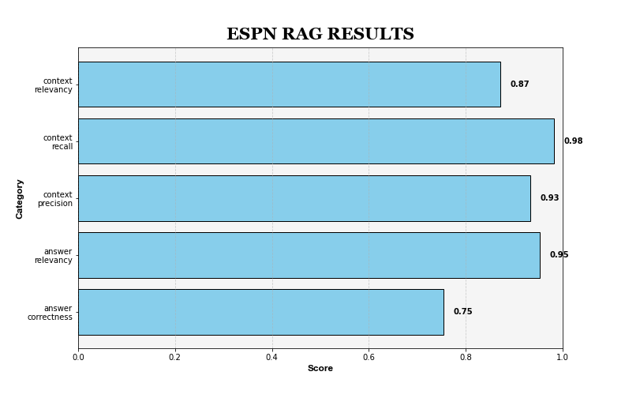

# HybridQRA

 HybridQRA is a Retrieval-Augmented Generation (RAG) engine focused on deep document understanding. It provides a RAG workflow utilizing the Qdrant vector database, enabling hybrid search by leveraging both dense and sparse vectors. To answer a given query, the vector database is queried to retrieve the most relevant contexts from the documents. The top contexts are then re-ranked using the "BAAI/bge-reranker-v2-m3" model, and only the highest-scoring paragraph is passed to the large language model (LLM) for accurate question-answering. In this project, the LLM used is GPT-4 through the Azure OpenAI API.

# Pipline Evaluation
Using Selenium, an automated script was developed to scrape articles from the ESPN website, extracting the article text (divided by paragraphs) along with several metadata attributes into a filtered pandas DataFrame containing only relevant, sports-related information.

The data was indexed into LlamaIndex documents and utilized as a test set for the project. A synthetic dataset was generated using the RAGAS API, and the pipeline’s performance was evaluated using five metrics from the RAGAS metrics suite.

Below are the evaluation results:



# Critic LLM - Optional
To ensure your answer's accuracy, you can use a critic LLM that will verify it. This is done by utilizing a specialized prompt with instructions and a few examples (few-shot learning) to check for common sense. You can choose whether to enable this feature in the config.yaml file. 

# Getting Started

1. Install dependencies from `requirements.txt`:
    ```bash
    pip install -r requirements.txt
    ```

2. Download the latest Qdrant image from DockerHub:
    ```bash
    docker pull qdrant/qdrant
    ```

3. Set up your environment variables to connect to the Azure OpenAI API:
    ```bash
    export AZURE_OPENAI_API_KEY="your_api_key_here"
    export AZURE_OPENAI_ENDPOINT="your_azure_endpoint"
    export AZURE_OPENAI_API_VERSION="your_api_version"
    export AZURE_OPENAI_CHAT_DEPLOYMENT_NAME="your_chat_deployment_name"
    ```

4. Modify `config.yaml` if necessary, to adjust settings such as the dense vector model, sparse vector model, LLM, number of top retrieved passages, re-ranked passages, and more.

5. Run the `main.py` file to execute the pipeline:
    ```bash
    python main.py
    ```

