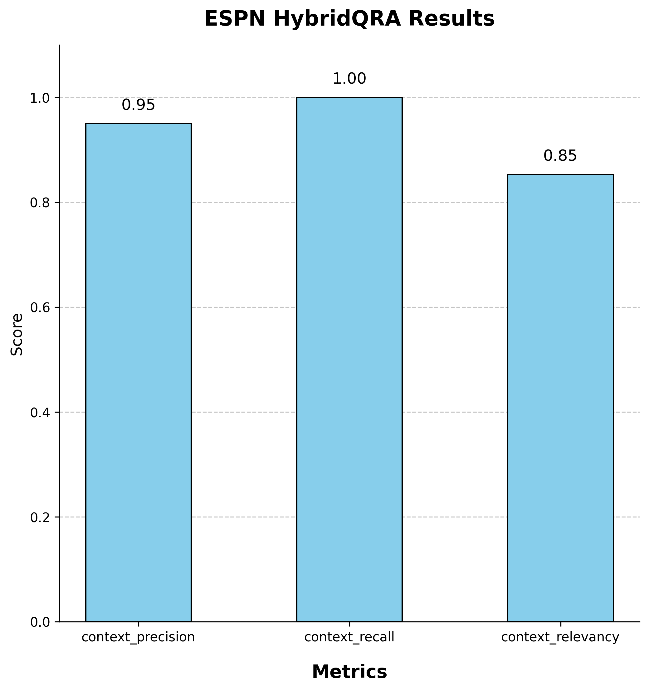
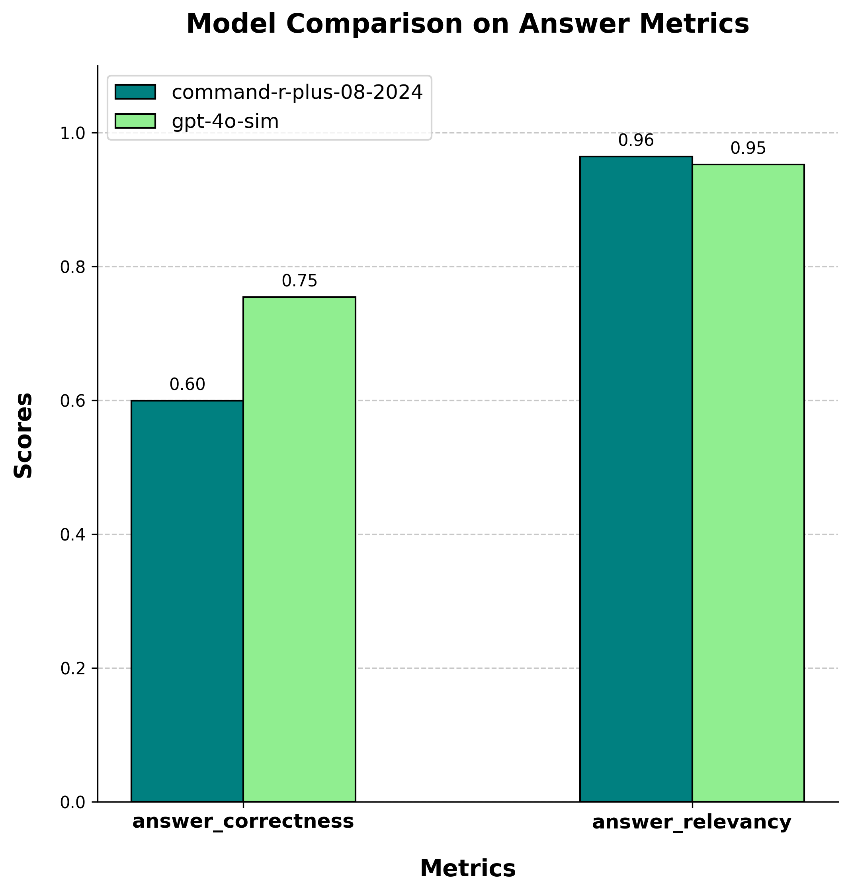

# HybridQRA

 HybridQRA is a Retrieval-Augmented Generation (RAG) engine that leverages the Qdrant vector database to enable hybrid search, combining both dense vectors (based on semantic similarity) and sparse vectors (based on keyword search). 
To answer a given question, the vector database is queried to retrieve the most relevant contexts from the documents. These contexts are then re-ranked using cohere's "rerank-v3.5" model, and only the highest-ranking paragraph is forwarded to the large language model (LLM) for precise question-answering.
The entire project, including the website and chat UI, was containerized using Docker and deployed on AWS.    
 <strong>Feel Free to check out Hybridqra website:</strong> 
 <a href="http://51.20.19.95/" style="color: blue;">http://51.20.19.95/</a>

# Evaluation With ESPN Articles

An automated script was developed using Selenium to scrape articles from the ESPN website, one of the world's largest sports platforms, extracting article text (organized by paragraphs) along with various metadata attributes. The data was filtered and stored in a pandas DataFrame, ensuring that only relevant, sports-related information was retained. The test set for this project was a synthetic dataset generated from the articles using RAGAS. Below are the evaluation results of HybridQRA's performance based on RAGAS metrics, alongside a comparison of Cohere's "command-r-plus-08-2024" and OpenAI's "gpt-4o-sim" models in terms of their capabilities.
It is important to note that HybridQRA is responsible solely for retrieving and ranking the most relevant contexts, while the LLM model determines the final answer's relevance and correctness. The quality of the response is influenced by both components—HybridQRA ensures that the model receives high-quality context, but the ultimate accuracy and coherence of the answer depend on the LLM's reasoning and generation capabilities.

Below are the evaluation results:

  
  

